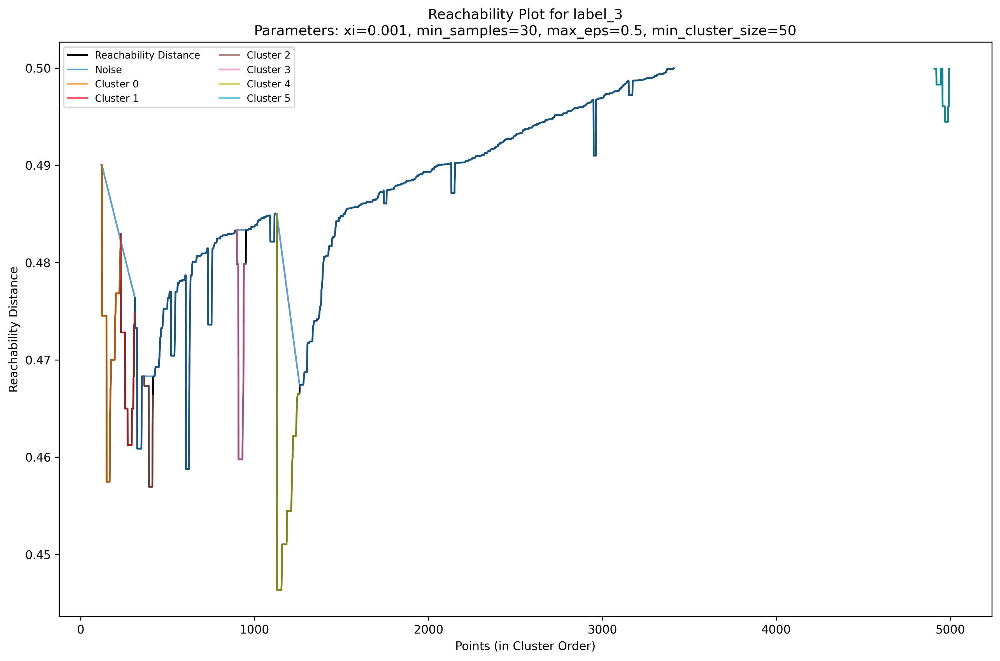

# 🦠 Immune Cell Clustering in Rheumatoid Arthritis
### *Leveraging Density-Based Clustering (OPTICS) to decode immune landscapes in RA Flare & Remission.*

<div align="center">
  
</div>

## 🔬 OVERVIEW
This repository houses the research and computational framework for the project: **"Density-Based Clustering in Immune Cell Cytometry Data."** By utilizing flow cytometry data from the **BioFlare project**, this study applies advanced density-based algorithms to identify discrete immune cell populations. The goal is to isolate high-dimensional cellular signatures associated with **Rheumatoid Arthritis (RA)** disease states, distinguishing between active flare and clinical remission.

## 🧬 METHODOLOGY
Unlike traditional K-Means, this pipeline utilizes **OPTICS (Ordering Points To Identify the Clustering Structure)** to handle the varying densities and noise inherent in biological cytometry data.

* **Dimensionality Reduction:** Implementation of **t-SNE** and **UMAP** to project 20+ parameter cytometry data into interpretable 2D manifolds.
* **Clustering:** Application of **OPTICS** to detect clusters of arbitrary shape and identify outlier "noise" cells.
* **Visualization:** Generation of **Reachability Plots** to visualize the hierarchical density structure of the immune landscape.

## 🚀 KEY FEATURES
- ✅ **OPTICS Implementation:** Robust density-based clustering for noisy biological datasets.
- ✅ **Multi-Manifold Visualization:** Comparative analysis using both **UMAP** and **t-SNE**.
- ✅ **Noise Detection:** Automated identification of non-clustered "outlier" cell populations.
- ✅ **Clinical Context:** Analysis focused specifically on RA flare/remission biomarkers.

## 📁 PROJECT STRUCTURE
```bash
Rheumatoid-Arthritis/
├── clustering.py           # Core implementation of OPTICS algorithm
├── reachability_plot.py    # Visualization of clustering hierarchy & density
├── umap.py                 # UMAP manifold projection scripts
├── tsne.py                 # t-SNE visualization scripts
├── Dissertation_final.pdf  # Comprehensive theoretical and clinical results
└── individual_presentation_RA.pdf # Summary of key findings and visualizations
```
## ⚙️ USAGE GUIDE
### 1️⃣ Installation
Ensure all scientific dependencies are installed:
```bash
pip install numpy scipy matplotlib scikit-learn umap-learn
```
### 2️⃣ Execute Analysis
Run the clustering engine:
```bash
python clustering.py
```
Generate biological visualizations:
```bash
python reachability_plot.py   # View density hierarchy
python umap.py                # View UMAP landscape
python tsne.py                # View t-SNE landscape
```
## 📊 CORE VISUALIZATIONS
- **Reachability Plot:** Represents the clustering hierarchy, where "valleys" indicate clusters and "peaks" indicate gaps in density.
- **UMAP/t-SNE:** Scatter projections allowing for the manual annotation of cell types (e.g., T-cells, B-cells, Monocytes) based on clustering results.

## 🙌 ACKNOWLEDGEMENTS
- **BioFlare Project:** For providing the specialized flow cytometry datasets.
- **Faculty of Medical Sciences:** Supporting the computational immunology research.


